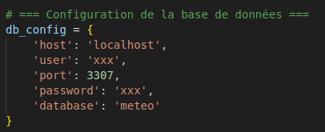

#  Création d'un site web sur la météo

##  Description
Ce projet est un site web interactif fournissant des prévisions météo complètes, intégrant un backend de machine learning pour des prédictions personnalisées et des fonctionnalités avancées d'information environnementale.

---

##  Technologies utilisées

- **API en Python avec Machine Learning**
- **Backend en PHP**
- **Frontend en HTML / CSS / JavaScript**

---

##  Fonctionnalités principales

- **Prévisions sur 3 jours** : Affichage complet de la météo pour les 15 jours à venir.
- **Géolocalisation** : Affichage de plusieurs ville et commune de France.
- **Lisible pour tous**: Application utilisable pour les daltonien via l'extention (ColorBlindly)

---

##  Ergonomie et design

- **Structuration de l'information** : Affichage simplifier et claire des données météo / localisation etc...
- **Ergonomie de l'interface** : Minimisation des boutons et éléments supplémentaires pour une lecture optimisée.
- **Interface épurée** : Simplicité et intuitivité centrées sur les informations principales.

---

## 🌦️ Weather App – Suivi Trello

- 📋 **Trello du projet** : [Lien vers le board Trello](https://trello.com/b/Z9J4CJE4/weather-app)

---

## 🚀 Lancer le projet

1. **Connexion à PhpMyAdmin**  
   Assurez-vous d’être connecté au bon compte PhpMyAdmin pour accéder à la base de données (fichier api.py).  
   

2. **Générer les données pour le Machine Learning**  
   Depuis le dossier `API`, exécute le script d'entraînement :
   ```bash
   cd weather-app/API && python marchlearn.py

3. **Lancement du projet**  
   Depuis le dossier `API`, exécute le script de lancement du site :
   ```bash
   cd weather-app/API && python api.py
